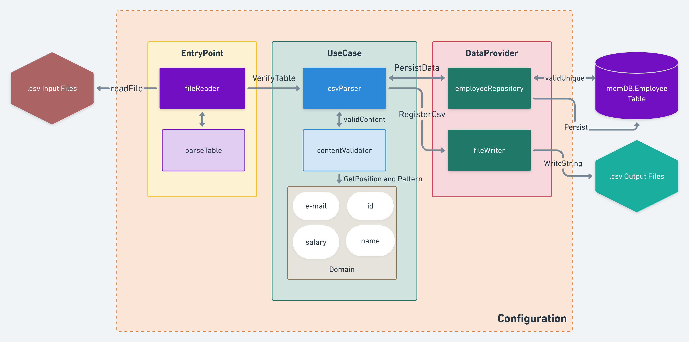

## Topics
* [Description](#description)
* [Architecture Diagram](#architecture-diagram)
* [Technologies](#technologies)
* [How to Run](#how-to-run)
* [Technical Debts](#technical-debts)
* [Developers](#desenvolvedores)
* [Helpful Links](#helpful-links)

## Description
This project consists on the development of a Csv-Parser program for helping companies to deal with different patterns of employees's information.
The input files need to be places at the **csv** folder of the project and after running it, if the information are valid, it will be registered in an output file named **validData.csv** on the root project folder.
The invalid information can also be traced at a csv file registered with the name **invalidData.csv** in the same folder.

## Architecture Diagram
The Architecture chosen for this project was the **Clean Architecture**. Following the image below, this project contains:
* An **Entrypoint** Layer, responsible for starting the jobs by reading the Input Csv files on the csv/ folder.
* An **UseCase** Layer, being the Heart of the application, containing the overall business logic.
* A **DataProvider** Layer, responsible for the connection with the Database for persistence and writing the Output files.
* A **Configuration** Layer, which contains the configuration for the whole project, in this case being responsible for the Database connection.

In each layer, the project counts with unit tests.
The project Architecture in details is presented in the image below:

 

## Technologies

* **go-memdb**: For data persistence, it was used a memory Database in GoLang from **Hashicorp**, found on the link down below:
 	* > https://github.com/hashicorp/go-memdb

## How to Run
### Install Dependencies
* Before starting, make sure you have installed the following dependency to connect to the **go-memdb**:
 1. `go get -u github.com/hashicorp/go-memdb`

* This command will install the other two dependencies required to connect with go-memdb: **go-immutable-radix** and **golang-lru**
* Check if these 3 packages have been successfully installed on your 
* > $GOROOT/src/github.com/hashicorp/
* > $GOROOT/src/vendor/github.com/hashicorp/
* or:
* > $GOPATH/src/github.com/hashicorp/

### Install Dependencies manually
* If the previous steps didn't work, you can get it manually by using the following commands:
 1. `cd $GOROOT/src/`
 2. `mkdir github.com/hashicorp/`
 3. `cd github.com/hashicorp/`
 4. `git clone https://github.com/hashicorp/go-memdb.git`
 5. `git clone https://github.com/hashicorp/go-immutable-radix.git`
 6. `git clone https://github.com/hashicorp/golang-lru.git`

* Make sure you make the same steps for the $GOROOT/src/vendor folder

### Getting Started
* After downloading all the dependencies, you can install this project either by cloning on your $GOPATH/src or $GOROOT/src repository:
1. `git clone https://github.com/guimsmendes/employee-csv-parser.git`

* Or simply unzip the file on the sames repositories.
* Then, you can copy your .csv files on the **.../src/employee-csv-parser/csv** folder
* Make sure you are in the **.../src/employee-csv-parser** folder and then run the following command:
1. `go run main.go`

* All the steps are gonna be registered on the cmd, and the output files for **validData.csv** and **invalidData.csv** are gonna be registered at the same folder.

## Technical Debts

* This code could be evolved by replacing a few steps in the UseCase layer for a more cohesive code.
* It could also be evolved by aggregating the additional information on the .csv input files on the valid output files. In this first version, only the minimal required informations are being persisted on the database and registered on the output file.
* It also could have a database registered in a Cloud Service (AWS, Google Cloud, Azure) for all the employee's information could be registered and maintained.

## Developers

[    Guilherme Mendes ](https://github.com/guimsmendes) |
| :---: |  

## Helpful Links
* [Unit testing with GoLang](https://medium.com/rungo/unit-testing-made-easy-in-go-25077669318)
